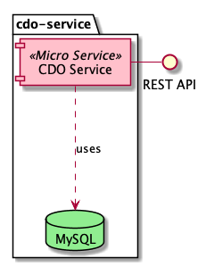

## Flatland CDO Server

Ready to use [CDO Server](https://www.eclipse.org/cdo/) with a generic rest API uses [EMF reflective API](https://www.eclipse.org/modeling/emf/).



## Start

```
cd ch.flatland.cdo.server.build
docker-compose up
```

## Test
```
curl -X GET \
  http://localhost:8199/manage/health
   
{
    "status": "UP"
}
```

```
curl -X GET \
  http://localhost:8199/node/repo/root
   
{
    "status": {
        "status": "OK"
    },
    "data": {
        "id": 3,
        "containerId": 1,
        "attributes": {
            "name": "root",
            "path": "/root"
        },
        "_links": {
            "self": {
                "href": "http://localhost:8199/obj/repo/eresource.CDOResourceFolder/3"
            }
        }
    }
}
```

## Sample Request
See [BasicProductTest.xtend](/ch.flatland.cdo.server.build/ch.flatland.cdo.server.product.test/src/ch/flatland/cdo/server/product/test/BasicProductTest.xtend)

## License
[Eclipse Public License Version 1.0 ("EPL")](http://www.eclipse.org/legal/epl-v10.html)
